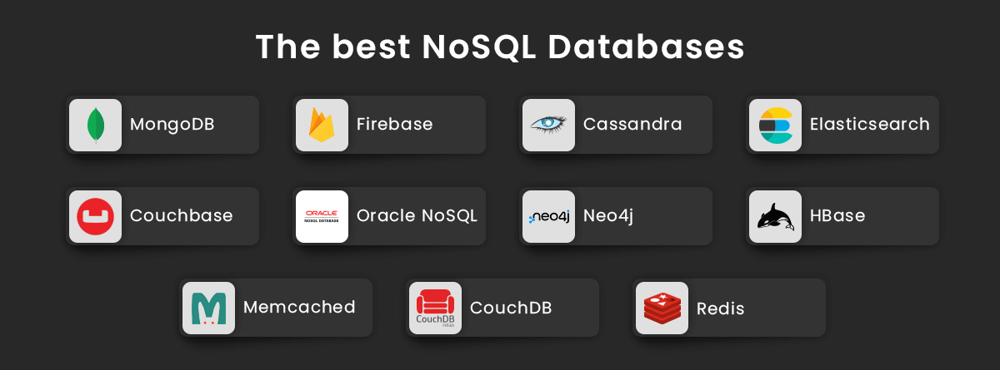

# L'architecture MVC

Le modèle MVC (Model-View-Controller) est un modèle architectural très couramment utilisé pour le développement de logiciels, en particulier pour les applications web. Cette méthode permet de séparer les différentes préoccupations de l'application.

## Qu'est-ce que le MVC?

* **Modèle (Model):** C'est la partie de l'application qui gère la logique des données.
* **Vue (View):** La vue est responsable de la représentation visuelle des données.
* **Contrôleur (Controller):** Le contrôleur gère les entrées utilisateur, c'est l'intermédiaire entre le modèle et la vue.

<figure><figcaption></figcaption></figure>

Le modèle MVC est apprécié par les entreprises pour plusieurs raisons :

1. **Séparation des préoccupations:** En divisant l'application en trois composants distincts (modèle, vue, contrôleur), chaque partie peut être développée, testée et maintenue indépendamment, ce qui améliore la qualité du code.
2. **Réutilisabilité:** Les composants du modèle et de la vue peuvent être réutilisés dans différentes parties de l'application ou dans d'autres projets, réduisant ainsi l'effort de développement.
3. **Facilité de maintenance:** En permettant de modifier la logique de business (modèle) ou l'interface utilisateur (vue) sans affecter les autres composants, MVC facilite la maintenance et l'évolution des applications.
4. **Collaboration améliorée:** Les équipes de développement peuvent travailler en parallèle sur le modèle, la vue et le contrôleur, ce qui accélère le cycle de développement.


Ces avantages font du MVC un choix privilégié pour les entreprises cherchant à développer des applications robustes et évolutives.


## Mise en place d'un projet PHP

### Création du modèle

Pour démarrer, nous devons établir une connexion avec la base de données MySQL en utilisant PDO (PHP Data Objects). Voici un exemple de fichier de configuration pour la connexion à la base de données :

```php
// config/connect.php
<?php
$host = '127.0.0.1';
$db = 'nom_de_la_base';
$user = 'nom_utilisateur';
$pass = 'mot_de_passe';
$charset = 'utf8mb4';

$dsn = "mysql:host=$host;dbname=$db;charset=$charset";
$options = [
    PDO::ATTR_ERRMODE            => PDO::ERRMODE_EXCEPTION,
    PDO::ATTR_DEFAULT_FETCH_MODE => PDO::FETCH_ASSOC,
    PDO::ATTR_EMULATE_PREPARES   => false,
];

try {
    $pdo = new PDO($dsn, $user, $pass, $options);
} catch (\PDOException $e) {
    throw new \PDOException($e->getMessage(), (int)$e->getCode());
}
?>
```

Ce fichier établit une connexion sécurisée à la base de données et doit être inclus dans vos scripts où nécessaire.

### Écriture des classes de modèle

Les classes de modèle sont essentielles pour interagir avec la base de données. Voici comment créer une classe de modèle simple pour gérer les opérations CRUD (Création, Lecture, Mise à jour, Suppression) pour une entité utilisateur.

```php
// UserModel.php
<?php
require_once 'config/connect.php';

class UserModel {
    private $pdo;

    public function __construct($pdo) {
        $this->pdo = $pdo;
    }

    public function getAllUsers() {
        $req = $this->pdo->query('SELECT * FROM users');
        return $req->fetchAll();
    }

    public function getUserById($id) {
        $req = $this->pdo->prepare('SELECT * FROM users WHERE id = ?');
        $req->execute([$id]);
        return $req->fetch();
    }

    public function createUser($name, $email) {
        $req = $this->pdo->prepare('INSERT INTO users (name, email) VALUES (?, ?)');
        return $req->execute([$name, $email]);
    }

    public function updateUser($id, $name, $email) {
        $req = $this->pdo->prepare('UPDATE users SET name = ?, email = ? WHERE id = ?');
        return $req->execute([$name, $email, $id]);
    }

    public function deleteUser($id) {
        $req = $this->pdo->prepare('DELETE FROM users WHERE id = ?');
        return $req->execute([$id]);
    }
}

```


En utilisant cette structure, vous pouvez facilement gérer les utilisateurs dans la base de données. Chaque méthode de la classe `UserModel` représente une opération courante permettant d'interagir avec les données.


### Création de la vue

Les templates sont des fichiers de présentation utilisés pour séparer la logique des affaires (Business Logic) du code de présentation en PHP. En isolant le code HTML des scripts PHP, vous obtenez une application plus structurée et plus facile à maintenir.

Voici un exemple simple de template avec PHP pour générer une page d'utilisateur.

```php
// template.php
<!DOCTYPE html>
<html lang="fr">
<head>
    <meta charset="UTF-8">
    <title><?= $title ?></title>
</head>
<body>
    <h1><?= $heading ?></h1>
    <p>Bienvenue, <?= $name ?>!</p>
</body>
</html>
```

#### Inclusion du template dans le contrôleur

```php
// controller.php
$title = "Page d'utilisateur";
$heading = "Bienvenue sur votre espace personnel";
$name = "Jean Doe";

include 'template.php';
```

### Création du Contrôleur

Le contrôleur est responsable de la gestion des requêtes utilisateur et de l'interaction avec les modèles.

#### Gestion des requêtes utilisateur

Le contrôleur reçoit les requêtes HTTP, traite les données si nécessaire, et délègue la partie de présentation au template correspondant.

#### Interaction avec les modèles

Le contrôleur utilise les classes de modèle pour récupérer et modifier les données, puis transmet ces données aux templates pour l'affichage.

```php
// userController.php
require_once 'UserModel.php';

$pdo = new PDO('mysql:host=localhost;dbname=mydatabase', 'user', 'password');
$userModel = new UserModel($pdo);

$users = $userModel->getAllUsers();
$title = "Liste des utilisateurs";

include 'userTemplate.php';
```
