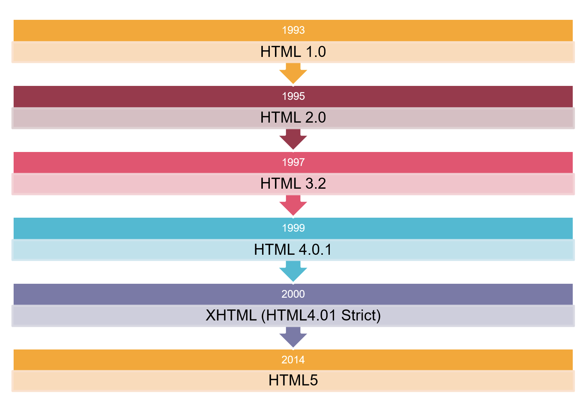
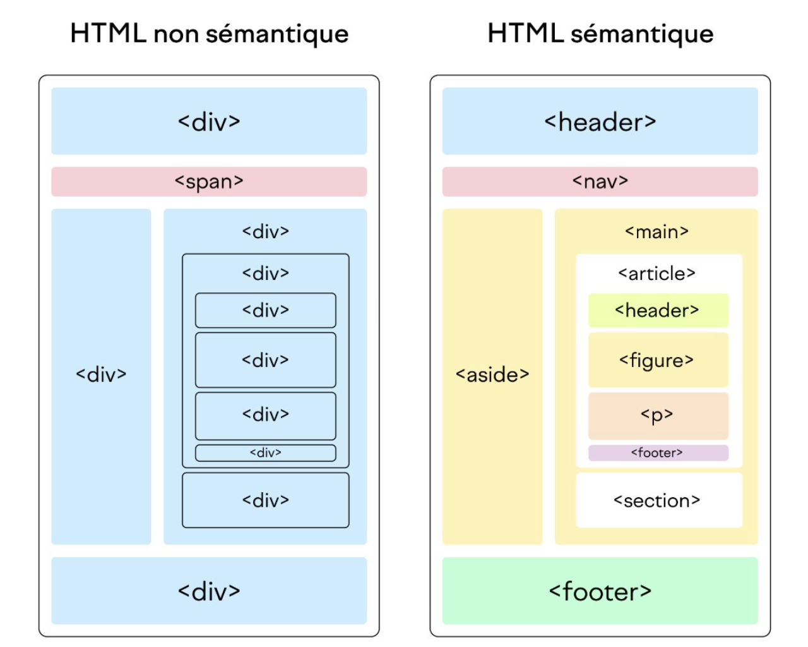

# Les fondamentaux du HTML

## C'est quoi le HTML ?

HTML, acronyme de **HyperText Markup Language**, est le langage de balisage standard utilisé pour créer et structurer le contenu des pages web. ​

Il fournit une manière de décrire la **structure logique d'une page web en utilisant des balises et des éléments** pour indiquer différents types de contenu tels que : des titres, des paragraphes, des listes, des liens, des images, des formulaires, etc…​

### Définition du HTML

HTML est un langage de balisage qui permet de définir la structure et le contenu d'une page web. Les balises HTML sont des éléments entourés de chevrons (< et >) qui indiquent au navigateur comment afficher le contenu. ​


Par exemple, \<p> est la balise utilisée pour définir un paragraphe de texte.​


HTML est l'un des piliers fondamentaux du développement web. Il fournit la structure de base nécessaire pour créer des sites web interactifs et bien structurés. ​

​Sans HTML, il serait impossible de créer des pages web telles que nous les connaissons aujourd'hui, avec des fonctionnalités telles que la navigation, la présentation de contenu et l'interaction avec l'utilisateur.​

### Historique

<figure><figcaption></figcaption></figure>

## Structure de base

### Nouveautés du HTML5

Certaines des nouveautés les plus importantes incluent :​

* **Les balises sémantiques** comme \<header>, \<footer>, \<nav>, \<article>, etc., qui rendent le code HTML plus expressif et significatif pour les moteurs de recherche et les lecteurs d'écran.​
* **Le support natif de la vidéo et de l'audio**, permettant aux développeurs d'intégrer facilement des médias dans leurs pages web sans recourir à des plugins tiers.​
* **Les API JavaScript avancées, comme l'API Canvas** pour le dessin dynamique, **l'API Drag and Drop** pour le glisser-déposer, et **l'API Geolocation** pour la géolocalisation des utilisateurs.​
* Le **stockage local et la gestion hors ligne des données** à l'aide de l'API Web Storage et de l'API Application Cache, offrant une expérience utilisateur améliorée même en l'absence de connexion Internet.​

### Les balises principales

La balise est une instruction pour le navigateur web qui indique la version du langage de balisage utilisée dans le document, dans ce cas, HTML5. Cette déclaration permet au navigateur de savoir comment interpréter et afficher correctement le contenu de la page.​

La balise **\<html>** englobe l'ensemble du document HTML et définit le début et la fin du document.​

La balise **\<head>** contient des métadonnées sur le document telles que le titre de la page, les liens vers des feuilles de style CSS, les scripts JavaScript, etc.​

La balise **\<body>** encapsule le contenu principal de la page, y compris les éléments visibles tels que le texte, les images, les liens, etc.​

### Les balises de titres et de paragraphes


Les balises de titre \<h1> à \<h6> sont utilisées pour définir la hiérarchie des titres sur une page web. ​


\<h1> est généralement utilisé pour le titre principal, suivi de \<h2> pour les sous-titres, et ainsi de suite jusqu'à \<h6> pour les titres de niveau le plus bas.​


​La balise \<p> est utilisée pour définir des paragraphes de texte sur une page web. ​


Elle est souvent utilisée pour séparer et structurer le contenu textuel en paragraphes distincts, facilitant ainsi la lisibilité et la compréhension pour les utilisateurs.​

```html
<body>
  <h1>Mon Premier Titre</h1>
  <p>Ceci est un paragraphe sous le titre.</p>
  <h2>Un Sous-Titre</h2>
  <p>Un autre paragraphe.</p>
</body>
```

### La \<div> : élément de division de contenus

L'élément HTML \<div> (ou division) est le conteneur générique du contenu du flux. ​

Il n'a aucun effet sur le contenu ou la mise en page tant qu'il n'est pas mis en forme d'une manière quelconque à l'aide de CSS.​

Il est plutôt utilisé pour regrouper le contenu afin qu'il puisse être facilement stylé à l'aide des attributs class ou id, pour marquer une section d'un document comme étant écrite dans une langue différente (à l'aide de l'attribut lang), etc.​

```html
<div class="warning">
    <p>Le copier/coller a été créé par des programmeurs pour des programmeurs.</p>
</div>
```

### Le conteneur générique \<span>

L'élément HTML \<span> est un conteneur générique en ligne (inline) pour les contenus phrasés. ​


Il ne représente rien de particulier.​


Il doit uniquement être utilisé lorsqu'aucun autre élément sémantique n'est approprié. ​


\<span> est très proche de l'élément \<div>​


```html
<p>J'utilise span <span>ici</span> et pas là.</p>
```

### La sémantique du HTML5

<figure><figcaption></figcaption></figure>

## Astuces concernant l'écriture du HTML

Créer un nouveau document html s’avère très simple avec un très bon IDE comme ​ VS Code ​ ou Webstorm​.

Le gain de temps va petit à petit devenir essentiel pour un développeur qui prend du galon. Alors prenons quelques bonnes pratiques afin d’optimiser notre productivité :​

* Pour créer le contenu d’un document html5, il suffit de faire un **« ! »** puis d’appuyer sur Tab, remplacez ensuite les valeurs à modifier (lang, css …)​
* Emmet est préinstallé sur les IDE et vous pouvez donc également **créer une balise html en écrivant son label puis Tab**, la balise auto fermante sera alors insérée.​
* Il est possible de **déplacer des éléments en maintenant « Alt + flèche haut »** ou « Alt + flèche bas »​
* Idem **pour dupliquer : « Shift + Alt + haut »** (ou bas)​

## Liens, Images et Médias

### Intégration de liens

Les liens permettent de connecter différentes pages web entre elles et de naviguer facilement d'une page à une autre. Voici comment intégrer des liens dans une page HTML :​

* Utilisez la balise \<a> avec l'attribut ‘href’ pour spécifier l'URL de destination.​
* Ajoutez le texte du lien entre les balises d'ouverture et de fermeture \<a>.​

```html
<a href="url_de_votre_page">Texte du lien</a>
```

### Intégration d'images

Les images sont utilisées pour ajouter des éléments visuels à une page web et améliorer son attrait esthétique. Voici comment intégrer des images dans une page HTML :​

* Utilisez la balise \ avec l'attribut ‘src’ pour spécifier le chemin vers l'image.​
* Ajoutez une brève description de l'image à l'attribut alt pour des raisons d'accessibilité.​

```html

```


Attention à la balise alt : pour le SEO mais aussi et surtout pour l’accessibilité.​


### Intégration de vidéos

HTML5 offre un support natif pour la lecture de médias tels que la vidéo et l'audio. Voici comment intégrer des médias dans une page HTML :​

* Utilisez la balise \<video> pour intégrer une vidéo.​
* Utilisez la balise \<source> à l'intérieur de \<video> pour spécifier le chemin vers la vidéo et son type MIME.​

```html
<video width="largeur" height="hauteur" controls>
    <source src="chemin_vers_video.mp4" type="video/mp4" />
    Votre navigateur ne prends pas en charge la lecture de vidéos.
</video>
```


_Remarquez le texte en cas de problèmes de compatibilité​_


### Intégration de l'audio

Il est également possible d’intégrer des pistes audios à vos pages web, pour cela :​

* Utilisez la balise \<audio> pour intégrer un fichier audio.​
* Utilisez la balise \<source> à l'intérieur de \<audio> pour spécifier le chemin vers le fichier audio et son type MIME.​

```html
<audio controls>
    <source src="chemin_ver_piste_audio.mp3" type="audio/mp3" />
    Votre navigateur ne prends pas en charge la lecture de vidéos.
</audio>
```

## Formulaires et interactivité

### La création de formulaires

Pour créer un formulaire en HTML5, nous utiliserons la balise et ajouterons différents types d'éléments de formulaire à l'intérieur.​

Les champs peuvent être de type :​

* Texte​
* Zones de texte​
* Boutons​
* Couleurs …​

```html
<body>
  <h1>Contactez-nous</h1>
  <form action="/traitement" method="post">
    <label for="nom">Nom :</label>
    <input type="text" id="nom" name="nom">
    <br>
    <label for="message">Message :</label>
    <textarea id="message" name="message"></textarea>
    <br>
    <button type="submit">Envoyer</button>
  </form>
</body>
```

### Les éléments de formulaire

HTML5 introduit de nouveaux types d'éléments de formulaire et des attributs pour améliorer la convivialité et la fonctionnalité des formulaires web. ​

Voici quelques-uns des principaux éléments de formulaire en HTML5 :​

```html
<input type="text" /> <!-- Champs de texte simple -->
<input type="email" /> <!-- Champs de saisie d'adresse email avec validation -->
<input type="password" /> <!-- Champs de saisie de mot de passe avec protection -->
<input type="checkbox" /> <!-- Case à cocher -->
<input type="radio" /> <!-- Bouton radio qui demande de choisir parmi plusieurs -->
<select><option>Option A</option></select> <!-- Menu déroulant -->
<textarea></textarea> <!-- Zone de texte -->
```

### Validation de formulaire

Dans cet exemple :​

* L'adresse e-mail est requis (required) et doit correspondre au format d'une adresse valide (pattern). ​
* Le champ d'âge est également requis et doit être compris entre 18 et 100 ans (min et max). ​
* Le champ de commentaire a une limite de 100 caractères définie par l'attribut maxlength, et il est également requis.​

```html
<form>
    <label for="email">Adresse email :</label>
    <input type="email" id="email" name="email" required />
    <label for="age">Age :</label>
    <input type="number" id="age" name="age" min="18" max="100" required  />
    <label for="commentaire">Commentaire :</label>
    <textarea id="commentaire" name="commentaire" maxLength="100" required></textarea>
    <button type="submit">Soumettre</button> 
</form>
```

## Structuration avancée

### Éléments de sectionnement

HTML5 propose plusieurs éléments de sectionnement pour diviser et organiser le contenu d'une page web de manière logique. Les principaux éléments de sectionnement incluent :​

* \<header> : l'en-tête d'une section ou d'une page.​
* \<footer> : le pied de page d'une section ou d'une page.​
* \<nav> : une section de navigation.​
* \<article> : un contenu autonome et indépendant qui peut être réutilisé ou distribué séparément.​
* \<section> : une section générique d'un document.​


Ces éléments aident à structurer le contenu de manière plus significative, ce qui facilite la compréhension du contenu par les développeurs, les moteurs de recherche et les technologies d'assistance.​


### Éléments de contenus intégrés

HTML5 introduit également des éléments pour intégrer différents types de contenu directement dans une page web. Les principaux éléments de contenu intégré incluent :​

* \<video> : intégrer des vidéos dans une page web.​
* \<audio> : intégrer des fichiers audio dans une page web.​
* \<canvas> : un espace de dessin dynamique pour le rendu graphique à l'aide de JavaScript.​
* \<embed> : intégrer différents types de contenus multimédias tels que des vidéos, des audios et des applications dans une page web.​


Ces éléments offrent des fonctionnalités avancées pour enrichir le contenu d'une page web avec divers types de médias et de graphiques interactifs.​


### Bonnes pratiques

Pour garantir la maintenabilité du code HTML et optimiser les performances des ressources, voici quelques bonnes pratiques à suivre.​

#### Maintenabilité du code​

* Indentation et lisibilité​
* Commentaires​
* Utilisation sémantique des balises ​
* Réutilisation des composants​

#### Performance et optimisation des ressources​

* Compression ​
* Optimisation des images​
* Regroupement et minification des fichiers CSS et JavaScript ​
* Utilisation efficace des balises \<link> et \<script> ​

## La notion de style

### Mettre du style à nos pages

Le HTML seul ne fournit pas de style à nos pages web, alors nous avons la possibilité d'appliquer des attributs de style à nos différents éléments.​

Cette façon de procéder porte un nom, le style "inline", et même si il n'a pas bonne réputation, celui-ci reste quelques fois une solution de secours pour changer un style immédiatement.​

Nous y préfèrerons les feuilles de styles CSS, que nous verrons prochainement.​

​Voici un exemple de page écrit avec du style inline :​

```html
<h1 style="color: #FF5733; font-family: Arial, sans serif">Titre stylisé inline</h1>
<p style="font-size: 16px; line-height: 1.5; color: #333">
    Lorem ipsum dolor sit amet
</p>
<div style="background-color: #F0F0F0; padding: 20px;">
    <p style="font-size: 14px; color: #666">
        Ce paragraphe a un fond gris claire et une taille de police de 14px.
    </p>
</div>
```

### Pourquoi ne pas en abuser ?


Il est toutefois conseiller de limiter l'utilisation du style inline, pour maintenir la séparation des préoccupations entre la structure HTML et la présentation.​


En effet, retrouver un élément à modifier en termes de style peut vite devenir complexe sur des fichiers quelques peu géants.​

Il vaut mieux alors préférer les feuilles de style externes pour des projets plus importants, facilitant ainsi la maintenance et la cohérence.​

### Comment lier une feuille de style externe

​Pour lier une feuille de style externe à votre document HTML, vous pouvez utiliser la balise \<link> dans la section \<head> de votre fichier HTML. Voici comment faire :​

```html
<!DOCTYPE html>
<html lang="fr">
    <head>
        <meta charset="UTF-8">
        <meta name="viewport" content="width=device-width, initial-scale=1.0">
        <title>Titre de la page</title>
        <link rel="stylesheet" href="styles.css">
    </head>
    <body>
        <!-- Contenu de votre page -->
    </body>
</html>
```

## Une nouvelle interaction

L'API Popover est une nouvelle fonctionnalité intégrée aux navigateurs modernes qui simplifie la création d'éléments contextuels comme les menus, les info-bulles et les fenêtres modales. Grâce à l'attribut HTML `popover`, vous pouvez désormais créer des popups de manière déclarative, sans avoir besoin de JavaScript pour gérer les états d'ouverture/fermeture, le focus, les raccourcis clavier, etc.

L'API gère automatiquement le positionnement des popups au premier plan, la fermeture en cliquant à l'extérieur, la gestion du focus au clavier et l'accessibilité.&#x20;

Vous pouvez facilement associer un élément declencheur (un bouton par exemple) à un élément popup grâce aux attributs `popovertarget` et `popoverTargetAction`.

De plus, l'API Popover offre des fonctionnalités avancées comme le positionnement relatif à un élément d'ancrage grâce à l'attribut `anchor`. Cela permet par exemple de créer des menus contextuels ancrés à leur bouton d'ouverture.

### Exemple de popup simple

```html
<button popovertarget="monPopup">Ouvrir le popup</button>
<div id="monPopup" popover>
  <p>Contenu du popup</p>
</div>
```


Avec seulement quelques lignes de HTML, vous obtenez un popup entièrement fonctionnel, accessible au clavier et à la souris, et respectant les bonnes pratiques d'accessibilité web.


Pour en savoir plus :\
[https://developer.mozilla.org/fr/docs/Web/API/Popover\_API/Using](https://developer.mozilla.org/fr/docs/Web/API/Popover\_API/Using)
