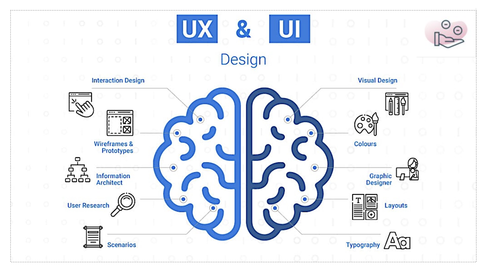

# Les fondamentaux du design web

Le **web design est l’art et la science de** **concevoir des interfaces utilisateur** pour le web. Il s’agit d’un domaine à la fois créatif et technique, qui requiert des compétences variées et une bonne connaissance des besoins des utilisateurs.&#x20;

Le **web designer est le professionnel qui crée ces interfaces,** en tenant compte des objectifs commerciaux, des contraintes techniques et des principes de l’ergonomie et de l’esthétique. Il travaille en collaboration avec les équipes de développement, de marketing et de contenu, pour offrir une expérience utilisateur optimale.

## Présentation du métier de web designer

### Responsabilités du web designer

Le webdesigner a pour mission de concevoir des interfaces utilisateur attrayantes et fonctionnelles, qui répondent aux besoins des utilisateurs et aux objectifs commerciaux.&#x20;

Pour cela, il doit :

* Analyser le cahier des charges et les besoins des utilisateurs, en utilisant des méthodes telles que les persona, les scénarios, les cartes dʼempathie, etc.
* Créer des maquettes et des prototypes interactifs, en utilisant des outils de conception tels que Sketch, Figma, Adobe XD, etc.
* Définir le style visuel et lʼidentité graphique de lʼinterface, en choisissant les couleurs, les typographies, les icônes, les images, etc.
* Respecter les normes et les bonnes pratiques du web, en matière dʼaccessibilité, de compatibilité, de performance, de sécurité, etc.
* Collaborer avec les équipes de développement, de marketing et de contenu, pour assurer la cohérence et la qualité de lʼinterface.
* Tester et améliorer lʼinterface, en utilisant des méthodes telles que les tests utilisateurs, les tests A/B, les analytics, etc.

### Compétences du web designer

Le web designer doit posséder un ensemble de compétences variées, qui lui permettent de réaliser ses tâches avec efficacité et créativité. Parmi ces compétences, on peut citer :

* La maîtrise des outils de conception, tels que Sketch, Figma, Adobe XD, etc.
* La compréhension des principes de lʼergonomie et de lʼesthétique, tels que la hiérarchie visuelle, la lisibilité, la cohérence, la simplicité, etc.
* La capacité à travailler en équipe et à gérer des projets, en utilisant des méthodes agiles, des outils de communication, des outils de gestion de tâches, etc.
* La curiosité et la veille, pour se tenir informé des tendances, des innovations et des bonnes pratiques du web design.

## Différences entre UI et UX Design&#x20;

### Définitions de lʼUI et de lʼUX Design

LʼUI (User Interface) Design est la discipline qui sʼoccupe de la conception de lʼinterface utilisateur, cʼest-à-dire de lʼensemble des éléments visuels et interactifs qui permettent à lʼutilisateur de communiquer avec le produit ou le service.

LʼUX (User Experience) Design est la discipline qui sʼoccupe de la conception de lʼexpérience utilisateur, cʼest-à-dire de lʼensemble des aspects qui influencent le ressenti, la satisfaction et la fidélisation de lʼutilisateur lors de son interaction avec le produit ou le service.

### Rôles de lʼUI et de lʼUX Design&#x20;

LʼUI et lʼUX Design sont deux domaines complémentaires, qui visent à offrir une interface utilisateur efficace, qui répond aux besoins et aux attentes des utilisateurs.&#x20;

LʼUI Design doit créer une interface utilisateur attrayante, qui capte lʼattention et lʼintérêt de lʼutilisateur, en utilisant des éléments visuels harmonieux et adaptés au contexte.

LʼUX Design doit créer une interface utilisateur fonctionnelle, qui facilite lʼaccomplissement des tâches et des objectifs de lʼutilisateur, en utilisant des éléments interactifs intuitifs et ergonomiques.

LʼUI Design doit créer une interface utilisateur cohérente, qui assure la continuité et la consistance de lʼinterface, en utilisant des éléments visuels et interactifs récurrents et reconnaissables.

LʼUX Design doit créer une interface utilisateur agréable, qui procure du plaisir et de lʼémotion à lʼutilisateur, en utilisant des éléments interactifs ludiques et stimulants.

<figure><figcaption></figcaption></figure>

### Exemples de lʼUI et de lʼUX Design&#x20;

Pour illustrer les différences et la complémentarité entre lʼUI et lʼUX Design, voici quelques exemples concrets dʼinterfaces utilisateur :

#### Netflix

Netflix est un service de streaming vidéo qui propose un large catalogue de films et de séries. Son interface utilisateur se caractérise par un design épuré et élégant, qui met en valeur les contenus et les recommandations personnalisées. Lʼinterface est également facile à utiliser, grâce à des menus simples et des boutons clairs. Lʼinterface offre une expérience utilisateur immersive et divertissante, qui incite à la découverte et au visionnage des contenus.

#### Spotify

Spotify est un service de streaming musical qui propose un accès illimité à des millions de titres. Son interface utilisateur se caractérise par un design coloré et dynamique, qui reflète la diversité et la richesse des genres musicaux. Lʼinterface est également intuitive et pratique, grâce à des fonctionnalités telles que la recherche, la création de playlists, le mode hors-ligne, etc. Lʼinterface offre une expérience utilisateur personnalisée et enrichissante, qui permet de découvrir et dʼécouter de la musique selon ses goûts et ses envies.

#### Duolingo

Duolingo est une application dʼapprentissage des langues qui propose des leçons ludiques et interactives. Son interface utilisateur se caractérise par un design simple et mignon, qui utilise des illustrations et des animations pour rendre lʼapprentissage plus amusant. Lʼinterface est également efficace et motivante, grâce à des mécanismes de gamification tels que les niveaux, les points, les récompenses, etc. Lʼinterface offre une expérience utilisateur éducative et divertissante, qui permet de progresser et de sʼaméliorer dans une langue.

## Importance du webdesign dans la création dʼune interface

### Impact du design sur lʼexpérience utilisateur et la perception dʼun produit ou dʼun service

Le design dʼune interface utilisateur nʼest pas seulement une question dʼesthétique, mais aussi dʼefficacité, de satisfaction et de fidélisation. En effet, le design a un impact direct sur lʼexpérience utilisateur et la perception dʼun produit ou dʼun service. Par exemple :

* Un design attrayant peut attirer lʼattention et lʼintérêt de lʼutilisateur, et lui donner envie dʼessayer ou dʼacheter le produit ou le service.
* Un design fonctionnel peut faciliter lʼutilisation et la compréhension du produit ou du service, et lui permettre dʼatteindre ses objectifs plus rapidement et plus facilement.
* Un design cohérent peut renforcer la confiance et la crédibilité de lʼutilisateur, et lui donner une impression de qualité et de professionnalisme.
* Un design agréable peut procurer du plaisir et de lʼémotion à lʼutilisateur, et lui donner envie de revenir ou de recommander le produit ou le service.

### Analyse de cas pour illustrer comment un bon design peut influencer positivement lʼexpérience utilisateur et contribuer au succès dʼun projet

Pour illustrer comment un bon design peut influencer positivement lʼexpérience utilisateur et contribuer au succès dʼun projet, voici quelques exemples de cas réels :

#### Airbnb

Airbnb est une plateforme de location de logements entre particuliers, qui permet de trouver des hébergements uniques et authentiques dans le monde entier. Son interface utilisateur se distingue par un design moderne et élégant, qui met en avant les photos et les avis des logements proposés. Lʼinterface est également simple et intuitive, grâce à des fonctionnalités telles que la recherche par carte, les filtres, les favoris, etc. Lʼinterface offre une expérience utilisateur conviviale et inspirante, qui permet de trouver et de réserver facilement le logement idéal pour son voyage.

#### Slack

Slack est une plateforme de communication et de collaboration pour les équipes de travail, qui permet de créer des espaces de discussion thématiques, dʼéchanger des messages, des fichiers, des appels, etc. Son interface utilisateur se caractérise par un design coloré et ludique, qui utilise des icônes, des emojis, des gifs, etc. pour rendre la communication plus fun et plus expressive. Lʼinterface est également efficace et pratique, grâce à des fonctionnalités telles que les notifications, les raccourcis, les intégrations, etc. Lʼinterface offre une expérience utilisateur productive et agréable, qui permet de travailler en équipe de manière plus fluide et plus interactive.

#### Medium

Medium est une plateforme de publication et de lecture dʼarticles, qui permet de partager et de découvrir des contenus de qualité sur divers sujets. Son interface utilisateur se distingue par un design minimaliste et élégant, qui met en valeur les textes et les images des articles. Lʼinterface est également facile à utiliser, grâce à des fonctionnalités telles que le mode lecture, les commentaires, les recommandations, etc. Lʼinterface offre une expérience utilisateur immersive et enrichissante, qui permet de lire et dʼécrire des articles de manière plus confortable et plus engagée.

### L'importance de lʼalignement entre les objectifs commerciaux, les besoins des utilisateurs et les décisions de conception dans la création dʼinterfaces efficaces

Pour créer une interface utilisateur efficace, il ne suffit pas de faire un design beau et fonctionnel, il faut aussi faire un design adapté et pertinent, qui corresponde aux objectifs commerciaux, aux besoins des utilisateurs et aux décisions de conception. Pour cela, il faut :

* Définir les objectifs commerciaux, cʼest-à-dire ce que le produit ou le service veut accomplir, quel est son marché, quelle est sa valeur ajoutée, etc.
* Définir les besoins des utilisateurs, cʼest-à-dire ce que les utilisateurs veulent faire, quel est leur profil, quelles sont leurs attentes, leurs motivations, leurs frustrations, etc.
* Définir les décisions de conception, cʼest-à-dire comment le produit ou le service va répondre aux objectifs commerciaux et aux besoins des utilisateurs, quelles sont les fonctionnalités, le style, le ton, etc.

Lʼalignement entre ces trois éléments est essentiel pour créer une interface utilisateur efficace, qui soit à la fois utile, utilisable et désirable. Cela permet de créer une interface qui :

* Répond aux besoins et aux attentes des utilisateurs, en leur offrant une solution adaptée à leur problème, une valeur ajoutée, une satisfaction, etc.
* Atteint les objectifs commerciaux, en générant du trafic, des conversions, des revenus, de la fidélisation, etc.
* Se différencie de la concurrence, en proposant une proposition de valeur unique, une identité forte, une personnalité, etc.


Le webdesign est un domaine passionnant et exigeant, qui demande de maîtriser des compétences variées et de connaître les besoins des utilisateurs. Le webdesigner est le professionnel qui crée des interfaces utilisateur attrayantes et fonctionnelles, qui offrent une expérience utilisateur optimale.

Le webdesigner doit savoir faire la différence entre UI et UX Design, et comprendre lʼimportance du webdesign dans la création dʼune interface efficace. Le webdesigner doit également aligner ses décisions de conception avec les objectifs commerciaux et les besoins des utilisateurs, pour créer une interface qui soit à la fois utile, utilisable et désirable.

