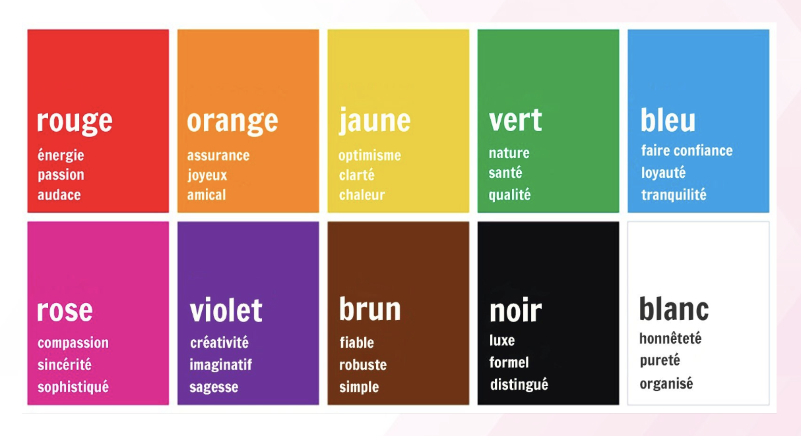
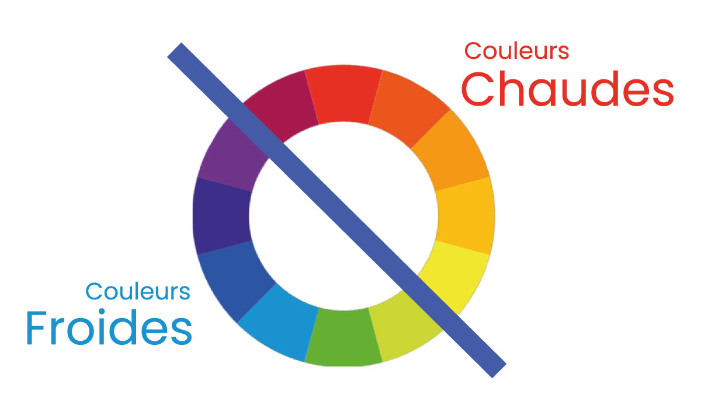

# Les règles du graphisme

Dans l'univers du design graphique, maîtriser les principes fondamentaux est essentiel pour créer des interfaces visuellement agréables et fonctionnelles. ​

Quelques « règles de graphisme » sont alors à prendre en compte :​

* Les principes des **lois de Gestalt​**
* Les **couleurs** : choix de palettes, contraste, accessibilité …​
* La **typographie** : choix de polices, tailles d’écritures …​
* Les **images** : formats d’image, résolution, droit à l’image …​

## Les principes essentiels

Introduction aux principes essentiels de la conception graphique avec la méthode des lois de Getsalt.

### La loi de bonne forme​

Loi principale dont les autres découlent. Nous cherchons a reconnaitre des formes familières, simples et stables. Nous regroupons des éléments qui vont ensemble pour avoir une perception globale. Sur les deux images, nous pouvons soit voir deux visages ou bien deux vases.

<figure><figcaption></figcaption></figure>

Le cerveau humain a tendance à privilégier les formes simples et régulières. ​C'est pourquoi un logo ou une icône simple sera plus facilement reconnaissable qu'une image complexe.​


_Exemple : Le logo d'Apple est une pomme simple et reconnaissable.​_


### La loi de proximité

Cette loi stipule que les éléments les plus proches vont être regroupés et perçus comme faisant partie d'un même groupe.

<figure><figcaption></figcaption></figure>

Les éléments qui sont proches les uns des autres sont perçus comme appartenant à un même groupe. ​C'est pourquoi il est important de bien organiser les éléments d'une page web ou d'une interface.​​


_Exemple : Les éléments d'un menu doivent être regroupés par catégories.​_


### La loi se similarité

Si la loi de proximité ne s'applique pas, alors nous chercherons à regrouper les éléments par leurs similitudes (forme, couleur, orientation... C'est pourquoi sur l'image de gauche, nous avons tendance à percevoir des lignes tandis que sur l'image de droite nous percevons plus facilement les colonnes.

<figure><figcaption></figcaption></figure>

Les éléments qui sont similaires entre eux sont perçus comme appartenant à un même groupe. ​C'est pourquoi il est important d'utiliser des couleurs, des formes et des textures cohérentes dans un design.​


_Exemple : Les boutons d'une interface doivent avoir la même forme et la même couleur.​_


### La loi de continuité

Nous nous représentons des éléments rapprochés comme des formes, nous percevons ces éléments comme un prolongement les uns par rapport aux autres. C'est pourquoi, sur l'image nous ne percevons pas un nuage de points, mais nous voyons apparaître “Bluedrop”.

<figure><figcaption></figcaption></figure>

Le cerveau humain a tendance à suivre les lignes et les formes continues. ​C'est pourquoi il est important de créer des designs fluides et faciles à parcourir.​​


_Exemple : Une page web doit avoir une navigation claire et intuitive.​_


### La loi de clôture&#x20;

Nous cherchons à interpréter les éléments comme un tout cohérent, c'est pourquoi nous ignorons les discontinuités et clôturons les forme incomplètes pour obtenir des figures fermées et une forme générale.

<figure><figcaption></figcaption></figure>

Le cerveau humain a tendance à fermer les formes incomplètes. ​C'est pourquoi il est important de créer des designs avec des formes bien définies.​


_Exemple : Un logo avec une forme ouverte sera moins reconnaissable qu'un logo avec une forme fermée.​_


### La loi de destin commun

Des formes ou des parties qui ont le même mouvement et qui vont dans la même direction seront perçues comme appartenant au même groupe

<figure><figcaption></figcaption></figure>

Les éléments qui se déplacent ensemble sont perçus comme appartenant à un même groupe. ​ C'est pourquoi il est important d'animer les éléments d'une interface de manière cohérente.​


_Exemple : Les éléments d'un menu déroulant doivent se déplacer de manière fluide.​_


### La loi de familiarité

Les formes familières sont perçues comme plus significatives. Nous sommes plus attirés par les éléments qui nous sont familiers.

<figure><figcaption></figcaption></figure>

Le cerveau humain a tendance à privilégier les formes et les concepts familiers. ​C'est pourquoi il est important de s'inspirer des conventions et des standards du design.​


_Exemple : Un bouton d'action doit ressembler à un bouton d'action.​_


## Couleurs, typographies et images

Nous allons nous concentrer sur l'impact des couleurs, de la typographie et des images dans la création d'interfaces efficaces.​

### La psychologie des couleurs

Les couleurs ont un impact important sur nos émotions et nos perceptions. Il est donc important de choisir les couleurs de votre interface avec soin. ​

> _Par exemple, le bleu est souvent associé à la confiance et à la sécurité, tandis que le rouge est associé à l'excitation et à l'urgence.​​_

<figure><figcaption></figcaption></figure>

### Le contraste

Le contraste est essentiel pour la lisbilité et l'accessibilité de votre interface. ​Assurez-vous qu'il y a un contraste suffisant entre le texte et l'arrière-plan, et entre les différents éléments de votre interface. ​


Il faut être au delà de 4.5:1 selon les WCAG.​


Un site vous permet de définir le ratio facilement selon les couleurs choisies :​\
[https://coolcontrast.vercel.app/](https://coolcontrast.vercel.app/)​

### Couleurs chaudes et couleurs froides

<figure><figcaption></figcaption></figure>

Les couleurs chaudes (rouge, orange, jaune) peuvent créer un sentiment d'urgence ou d'excitation. ​

Les couleurs froides (bleu, vert, violet) peuvent créer un sentiment de calme ou de confiance.​​

### La typographie

#### Taille de police​

La taille de la police doit être adaptée à la taille de l'écran et à la distance de lecture.​

#### Lisibilité

La police que vous choisissez doit être facile à lire à l'écran.&#x20;


**Évitez les polices trop fines ou trop décoratives.**


#### Hiérarchie visuelle ​

La typographie peut être utilisée pour créer une hiérarchie visuelle et mettre en valeur les titres, les paragraphes et les autres éléments importants de votre interface.​

### Les images

* Pertinence : Les images doivent être pertinentes pour le contenu de votre interface et pour le message que vous souhaitez transmettre.​
* Qualité : Les images doivent être de haute qualité et ne pas être pixellisées ou floues.​
* Taille : La taille des images doit être adaptée à la taille de l'écran et à la disposition de votre interface.​

|  |  |  |
| --------------------------------------------------------------------------------- | --------------------------------------------------------------------------------------- | ------------------------------------------------------------------------------------ |

## Exemples de bonnes pratiques

Quelques conseils à adopter si vous manquez de créativité …​

### L'utilisation et le choix des couleurs

**Utiliser une palette de couleurs limitée :** Choisissez une palette de couleurs cohérente et facile à lire. Limitez le nombre de couleurs à 3 ou 4 pour éviter de surcharger l'interface.​

**Utiliser le contraste pour mettre en valeur les éléments importants :** Assurez-vous qu'il y a un contraste suffisant entre le texte et l'arrière-plan, et entre les différents éléments de votre interface.​

Deux outils géniaux pour créer de superbes palettes : &#x20;





### L'utilisation de la typographie

**Choisir une police lisible à l'écran :** Évitez les polices trop fines ou trop décoratives. ​

**Privilégiez les polices sans empattement** pour les titres et les paragraphes longs. ​

Nous utiliserons toujours **au maximum 2 polices différentes,** une pour les titres et une autre pour les textes de type paragraphe.​





### Les techniques de mise en page​

Les grilles et les guides de mise en page permettent de créer une structure invisible qui organise les éléments de votre interface.​ Cela permet d'obtenir une mise en page ordonnée, équilibrée et cohérente.​

Il existe différents types de grilles, comme les grilles modulaires, les grilles basées sur les colonnes et les grilles fluides.​ Le choix de la grille dépendra du type de projet et des objectifs de conception.​

### L’utilisation des espaces blancs​

Les espaces blancs sont les zones vides entre les éléments de votre interface.​ Ils sont importants pour structurer l'interface et faciliter la lecture du contenu.​ Les espaces blancs permettent de créer une impression de légèreté et d'aération.​ Ils peuvent également être utilisés pour mettre en valeur certains éléments importants.​

### Les animations et interactions​

Elles peuvent rendre votre interface plus ludique et plus engageante.​ Elles permettent d'attirer l'attention de l'utilisateur et de le guider dans son exploration de l'interface.​ Il existe différents types d'animations, comme les transitions, les transformations et les micro-interactions.​ Les interactions peuvent être des clics, des survols, des défilements ou des gestes tactiles.​
