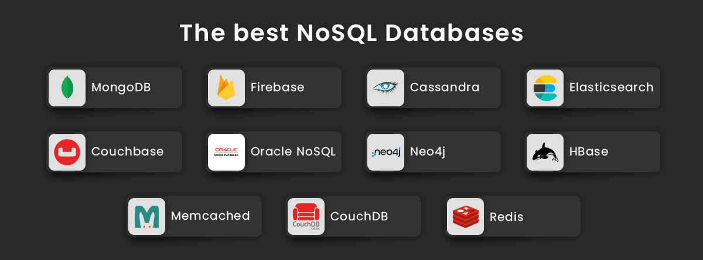

# Les solutions NoSQL

<figure><figcaption></figcaption></figure>

Voici quelques solutions parmi les plus populaires de développement en NoSQL :

* **MongoDB** : Supporte le sharding et les transactions multi-documents.
* **Firebase Firestore** : Temps réel et facile à intégrer avec d'autres services Google Firebase.
* **CouchDB** : Une des solutions NoSQL distribuée sous licence Apache.
* **DynamoDB** : Service de base de données NoSQL entièrement géré par AWS, qui offre des performances rapides et prévisibles.
* ...
